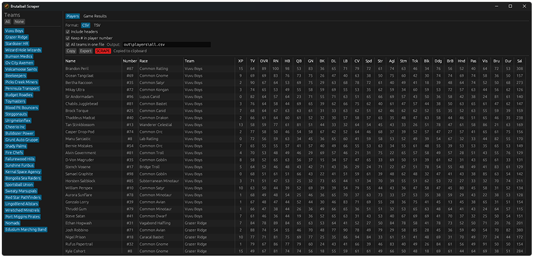

# Brutalball Scraper

A fast site scraper for Brutalball.



---

### Quick start (Windows)

* **Download** the latest release, e.g. `bb_scrape_v1.3.1_windows_x86_64.zip`.
* **Extract** it to a suitable folder.
* **Run** `bb_scrape.exe` for the GUI.
* Click **SCRAPE**.
* `Copy` to clipboard.
* `Export` to file → `out/players/all.tsv`.
*  Command-line users run `cli.exe`.

Tip: The left panel lets you pick which teams to scrape.

### Linux/macOS

**Option 1: Automated Setup (Recommended for non-developers)**

For users with no prior development tools installed:

```bash
# Download and extract the source code, then run:
./scripts/mac-linux/setup.sh
```

The script will:
- Check for required development tools (Xcode CLI Tools on macOS, build-essential on Linux)
- Install Rust if not present
- Build the project in release mode
- Optionally create a distribution package

**Option 2: Manual Build**

If you already have Rust installed:

```bash
# Build both binaries
cargo build --release

# Or build individually:
cargo build --release --bin bb_scrape  # GUI only
cargo build --release --bin cli        # CLI only
```

<details>
<summary><b>Detailed Manual Setup (from scratch)</b></summary>

### macOS - Complete Setup

**Prerequisites (one-time setup):**

1. **Install Xcode Command Line Tools** (provides compiler and git):
   ```bash
   xcode-select --install
   ```
   Click "Install" in the popup and wait for completion.

2. **Install Rust**:
   ```bash
   curl --proto '=https' --tlsv1.2 -sSf https://sh.rustup.rs | sh
   source $HOME/.cargo/env
   ```

3. **Clone the repository**:
   ```bash
   git clone https://github.com/Imsvale/bb_scrape.git
   cd bb_scrape
   ```

4. **Build**:
   ```bash
   cargo build --release
   ```
   First build takes 10-20 minutes. Binaries output to:
   - GUI: `target/release/bb_scrape`
   - CLI: `target/release/cli`

5. **Run**:
   ```bash
   ./target/release/bb_scrape  # GUI
   ./target/release/cli --help # CLI
   ```

6. **Package (optional)**:
   ```bash
   ./scripts/mac-linux/build.sh --build-release
   ```

### Linux - Complete Setup

**Prerequisites (one-time setup):**

1. **Install build tools**:
   ```bash
   # Ubuntu/Debian:
   sudo apt-get update
   sudo apt-get install build-essential pkg-config libssl-dev git

   # Fedora/RHEL:
   sudo dnf groupinstall 'Development Tools'
   sudo dnf install pkg-config openssl-devel git

   # Arch Linux:
   sudo pacman -S base-devel git
   ```

2. **Install Rust**:
   ```bash
   curl --proto '=https' --tlsv1.2 -sSf https://sh.rustup.rs | sh
   source $HOME/.cargo/env
   ```

3. **Clone the repository**:
   ```bash
   git clone https://github.com/Imsvale/bb_scrape.git
   cd bb_scrape
   ```

4. **Build, Run, Package** - same as macOS steps 4-6 above.

</details>

---

### Features

* **Scrape** for **Players** and **Game results** (current season)
  * Also **teams**, but that's more of an incidental side thing.
* **Player data:** `Name, #00, Race, Team, TV, OVR, ..., Dur, Sal`
* **Formats:**
  * Tab-separated values `(TSV)` - default
  * Comma-separated values `(CSV)`
* **Toggle headers**
* **Page-specific optionals:**
  * **Players:** Toggle player number `#` sign
  * **Game results:** Toggle game ids column
* **Copy to clipboard**
* **Export to file**
  * All-in-one file
  * Separate file per team (where applicable)
* **Select** which teams to scrape.
  * `All` / `None`
  * `Ctrl + click`: Select individual teams
  * `Shift + click`: Select range of teams
  * `Ctrl + Shift + click`: Select multiple ranges
* **Scrape** to update on demand.
* **Data cached locally**

---

### Defaults

* **Export directory:**
  * `out/players`
* **Format:** `TSV`
* **Export file (single):** `all.tsv`
* **Export files (multi):** `<Team_Name>.tsv`
* **Local cache:** `.store`

---

### Command line usage

Run:

```bash
./cli
```

Scrapes all teams and outputs all players to default directory and file: `out/players/all.tsv`.

Print help:

```bash
./cli -h
```

Common flags:

```
-h, --help                  Show help text
-l, --list-teams            Print id and name for all teams

SCRAPE:
-p, --page <page>           Which page to scrape (default: players)
                            Valid pages: players|game-results|teams
-t, --team <id>             One team by id (0–31)
-i, --ids <list>            Subset of ids, e.g. 0,2,5-7

EXPORT:
-m, --multi, --per-team     Per-team files (Players, Game Results)
-x, --drop-headers          Do not write the header row
-s, --skip-optional         Page-agnostic: Players → remove '#'; Results → drop match id
-f, --format tsv|csv        Output format (default: tsv)
-o, --out <path>            Output file path (single) or directory (per-team)
```

Examples:

```bash
# One team (id 16 = BDP) → TSV
./cli --team 16 --format tsv --out out/bdp.tsv

# Same as above with short-form flags
./cli -t 16 -f tsv -o out/bdp.tsv

# A subset of teams → per-team CSVs in a specified folder
./cli --ids 0,2,5-7 -o out/week8

# Fetch and export team names and ids
./cli --page teams -o out/teams.csv
```

---

### Caching & Refresh

* The app stores raw datasets under `.store`.
* On startup, it loads the cache if present.
* Team names are refreshed with a **SCRAPE**.

---

## Development & Releases

### Building from Source
```bash
cargo build --release                    # Both binaries
cargo build --release --bin bb_scrape    # GUI only
cargo build --release --bin cli          # CLI only
```

**Release convenience scripts:**

Platform-specific scripts automate building and packaging:

**Windows (PowerShell):**
```powershell
.\scripts\windows\build.ps1 -BuildRelease  # Build binaries and create release archive
.\scripts\windows\build.ps1                # Package only (skip build)
```

**Linux/macOS (Bash):**
```bash
./scripts/mac-linux/build.sh --build-release  # Build binaries and create release archive
./scripts/mac-linux/build.sh                  # Package only (skip build)
```

**What they do:**
- Build release binaries (with `-BuildRelease` or `--build-release` flag)
- Extract version from `Cargo.toml`
- Create versioned directory: `artifacts/v{version}/`
- Create platform-specific archive with flattened structure (executables at root)
- Generate SHA256 checksum file
- **Windows:** Use 7-Zip if available, falls back to PowerShell's Compress-Archive
- **Linux/macOS:** Auto-detect platform and architecture (x86_64/aarch64)

### Creating a Release

**Using the release scripts (recommended):**

Build on each platform or use cross-compilation:

```bash
# 1. Bump version in Cargo.toml
# 2. Update CHANGELOG.md
# 3. Commit and push changes
git add Cargo.toml Cargo.lock CHANGELOG.md
git commit -m "v{version}"
git push

# 4. Build and package on each platform:

# Windows (PowerShell):
.\scripts\windows\build.ps1 -BuildRelease

# Linux (Bash):
./scripts/mac-linux/build.sh --build-release

# macOS (Bash):
./scripts/mac-linux/build.sh --build-release

# 5. Create GitHub release with all platform artifacts
git tag v{version}
git push origin v{version}
gh release create v{version} --title "v{version}" --notes-file CHANGELOG.md \
  "artifacts/v{version}/bb_scrape_v{version}_windows_x86_64.zip" \
  "artifacts/v{version}/bb_scrape_v{version}_windows_x86_64.zip.sha256" \
  "artifacts/v{version}/bb_scrape_v{version}_linux_x86_64.zip" \
  "artifacts/v{version}/bb_scrape_v{version}_linux_x86_64.zip.sha256" \
  "artifacts/v{version}/bb_scrape_v{version}_macos_x86_64.zip" \
  "artifacts/v{version}/bb_scrape_v{version}_macos_x86_64.zip.sha256"
```

**Manual release (without script):**
```bash
# 1. Bump version in Cargo.toml
# 2. Update CHANGELOG.md
# 3. Commit and push changes
git add Cargo.toml Cargo.lock CHANGELOG.md
git commit -m "v{version}"
git push

# 4. Build binaries
cargo build --release

# 5. Create release archive manually
# Collect: target/release/bb_scrape.exe, target/release/cli.exe, README.md, LICENSE
# Create: bb_scrape_v{version}_windows_x86_64.zip
# Generate SHA256 checksum

# 6. Create GitHub release
git tag v{version}
git push origin v{version}
gh release create v{version} --title "v{version}" --notes "<changelog excerpt>" <zip-file> <checksum-file>
```

---

### License

MIT. Use at your own risk.
